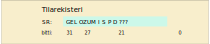

<div>
<lead>
Tässä osiossa käymme läpi esimerkkitietokoneena käytettävän opetuskäyttöön suunnitellun tietokoneen ttk-91 perusrakenne ja sen ohjelmointi symbolisella konekielellä. (Aliohjelmien toteutus käsitellään seuraavassa luvussa.)
</lead>
</div>


## Ttk-91
Yleiskuva ttk-91 arkkitehtuurissa annettiin kurssin Tietokoneen toiminnan perusteet luvussa 2. Jos nämä tiedot eivät ole ihan tuoreessa muistissa, voit haluta lukea luvun 2 uudelleen nyt. Näitä tietoja kerrataan (vähän) ja täsmennetään nyt tässä. Kannattaa jo tässä vaiheessa tutustua Titokoneen ja Titotrainerin käyttöön [täältä](https://tietokoneen-toiminnan-jatkokurssi.mooc.fi/luku-5/5-titokone-titotrainer) ja kokeilla tässä luvussa esitettyjä asioita. Näin saat opittua asiat konkreettisemmin.

## Rekisterit
Ttk-91 suorittimella on 8 konekäskyissä viitattavaa rekisteriä. Ne on nimetty R0 - R7. Näistä rekisterillä R6 on myös nimi SP (stack pointer eli pino-osoitin) ja rekisterillä R7 nimi FP (frame pointer eli kehysosoitin). Pino-osoitinta ja kehysosoitinta käytetään aliohjelmien toteutuksessa, joka on seuraavan luvun (Luku 6) aihepiiri. Rekisterit R0 - R5 ovat niin sanottuja työrekistereitä - niihin voidaan tallettaa kaikkien operaatioiden tulos ja ne voivat sisältää aritmeettis-loogisten operaatioiden ensimmäisen operandin.

Rekistereitä R1 - R7 (yleensä vain R1 - R5) voi käyttää myös indeksirekisterinä jälkimmäisen operandin arvon määrittämisessä. Aina indeksirekisterin käytölle ei ole tarvetta. Konekäskyn bittiesityksessä on kuitenkin paikka kahta rekisteriä varten, joten jos jälkimmäisen operandin arvon määrittämisessä ei tarvitse käyttää indeksirekisteriä, tämän tiedon on oltava jollain tavoin koodattu konekäskyyn. Ttk-91 -koneessa tämä koodaus on tehty siten, että kääntäjä asettaa konekäskyn bittiesityksessä indeksirekisteriksi rekisterin R0 merkitsemällä konekäskyn indeksirekisterin ilmaisevaan kohtaan arvon 0. Rekisterissä R0 saa olla käskyn suoritushetkellä mikä tahansa arvo, mutta se ei aiheuta mitään ongelmaa: ttk-91 -suoritin tulkitsee indeksirekisteristä haettavaksi arvoksi 0 sen sijaan että se hakisi R0:n todellisen arvon.

<!-- kuva: ch-5-1-a-ttk91-suoritin    -->

![Suoritin ja väylä tarkemmin. Väylä on jaettu kolmeen eri osaan, jotka ovat dataväylä, osoiteväylä ja kontrolliväylä. Suorittimen sisällä on neljä komponenttia, jotka ovat muistinhallintayksikkö MMU, rekisterit, aritmeettis-looginen yksikkö ALU ja kontrolliyksikkö CU. Välimuisti puuttuu kuvasta kokonaan. Aritmeettis-loogisessa yksikössä on esimerkin vuoksi mainittu ADD- ja MUL-suorituspiirit. Suorittimen komponentteja yhdistää niiden välinen oma sisäinen dataväylä ja niiden välisen kommunikoinnin toteuttavat kontrollisignaalit. Väylän lähellä on muistinhallintayksikkö MMU, jossa on sisäiset rajarekisterit Base ja Limit, muistin osoitusrekisteri MAR, muistin puskurirekisteri MBR ja väylän kontrollirekisteri BusCtl. Rekistereitä on kahdeksan kappaletta, R0 - R7. Kontrolliyksikkössä on neljä sisäistä rekisteriä. Ne ovat paikanlaskuri PC, käskyrekisteri IR, tilarekisteri SR ja tilapäisrekisteri TR.](./ch-5-1-a-ttk91-suoritin.svg)
<div>
<illustrations motive="ch-5-1-a-ttk91-suoritin"></illustrations>
</div>

Suorittimen kontrolliyksikössä on neljä nimettyä rekisteriä: PC, SR, IR ja TR. Paikanlaskuri PC (Program Counter) osoittaa aina seuravaksi suoritettavaan konekäskyyn. PC-rekisteriin voi konekäskyissä viitata epäsuorasti, jolloin esimerkiksi hyppykäsky asettaa PC:lle uuden arvon. Konekäskyillä voi ttk-91 koneessa PC:lle kuitenkin vain asettaa uusia arvoja, mutta sen nykyarvoa ei voi lukea mitenkään. (Joissakin todellisissa suorittimissa PC-rekisteri voi olla luettavissa ja kirjoitettavissa yleisrekistereiden tapaan.)

Käskyrekisteri IR (Instruction Register) sisältää suoritettavana olevan konekäskyn, joka on juuri haettu muistista. Rekisteri IR on valmiiksi langoitettu sillä tavoin, että käskyn eri kentät (operaatiokoodi, nimettyjen rekistereiden numerot, jne) ovat sieltä helposti luettavissa.

Rekisteri TR (Temporary Register) on tilapäisrekisteri, jota käytetään jälkimmäisen operandin arvon laskennassa. Todellisissa suorittimissa on hyvin paljon tilapäisrekistereitä, joita käytetään eri tarkoituksiin käskyjen suorituksen aikana.

### Tilarekisteri SR
Tilarekisterillä SR (State Register) on monta tehtävää. Bitit P ja D rajoittavat suorittimen toimintaa tämän konekäskyn suorituksen yhteydessä. Bitti P (Privileged mode) kertoo, tapahtuuko tämän konekäskyn suoritus nyt etuoikeutetussa tilassa vai ei. Etuoikeutetussa tilassa voidaan suorittaa kaikkia konekäskyjä ja viitata mihin päin tahansa muistia. Bitti P laitetaan päälle (arvoksi tulee 1) esimerkiksi keskeytyskäsittelijäänsiirtymisen yhteydessä ja se palautetaan ennalleen (arvoksi tulee 0) sieltä palatessa.

<!-- kuva: ch-5-1-a2-ttk91-tilarekisteri    -->

<div>
<illustrations motive="ch-5-1-a2-ttk91-tilarekisteri"></illustrations>
</div>

Bitti D (Interrupts disabled) kertoo, ovatko keskeytysten käsittelyt sallittuja tällä hetkellä (tämän konekäskyn suorituksen lopussa) vai ei. Jos jokin keskeytys tapahtuu ja bitti D ei ole päällä (arvo 0), niin seuraavaksi suoritettava konekäsky ei olekaan PC:n osoittama käsky vaan kyseisen keskeytystyypin keskeytyskäsittelijän ensimmäinen käsky. Joissakin tapauksissa (yleensä käyttöjärjestelmän sisällä) halutaan keskeytymättä suorittaa jokin tietty konekäskyjen sarja alusta loppuun, mikä voidaan toteuttaa asettamalla D-bitti päälle (arvoon 1) vähäksi aikaa. Yleensä D-bittiä voi manipuloida vain etuoikeutetussa tilassa käyttöjärjestelmän koodissa.

Bitit G, E, L, O, Z, U, M ja S kertovat konekäskyn suorituksen päätyttyä, mitä suorittimella tapahtui tämän (tai muutaman aikaisemman) konekäskyn suorituksessa. Bitit G (Greater), E (Equal) ja L (Less) tallettavat vertailukäskyjen tuloksen. Vähän ehkä epäloogisesti niihin tallettuu myös tuloksen nollaan vertailu aritmetiikkaoperaatioiden jälkeen.

Bitit O, Z, U ja M laitetaan päälle, jos käskyn suorituksessa tapahtui jokin keskeytyskäsittelyä vaativa virhetilanne. Bitti O (Overflow) viittaa kokonaislukujen ylivuotoon, kun aritmetiikkaoperaation tulos ei mahdu 32-bittiseen tulosrekisteriin. Tämä voisi tapahtua esimerkiksi kertolaskun 1&nbsp;000&nbsp;000\*1&nbsp;000&nbsp;000 jälkeen. Bitti Z (divide by Zero) asetetaan päälle kokonaislukujen nollallajaon yhteydessä. Kokonaislukuaritmetiikan mukaisesti nollalla jaon tulosta ei ole määritelty, eikä tulosta voi tällöin rekisterissä esittää. Bitti U (Unknown instruction) viittaa siihen, että operaatiokoodi oli epäkelpo. Kaikki 8-bittiset luvut (esim. luku nolla) eivät ole käytössä operaatiokoodeina. Bitti M (forbidden Memory address) laitetaan päälle, jos nyt suorituksessa olevan käskyn tai sen käyttämän datan yhteydessä on yritetty viitata sallitun muistialueen ulkopuolelle.

Bitti S (Supervisor call) asetetaan päälle, jos suorituksessa oli SVC (SuperVisor Call) konekäsky. Sen toteutus on hyvin samanlainen virhetilanteiden käsittelyn kanssa. SVC-käskyssä sen vakiokentässä on halutun käyttöjärjestelmäpalvelun numero. Esimerkiksi ttk-91 suorittimella käyttöjärjestelmä palvelu 11 (symbolin HALT arvo) käsittää toimenpiteet, joilla meneillään olevan ohjelman suoritus lopetetaan.

Bitti I (device Interrupt) kertoo, että tämän konekäskyn suorituksen aikana jokin ulkoinen laite aiheutti I/O-laitekeskeytyksen. I/O-laitekeskeytys tarkoittaa, että kyseinen I/O-laite (esim. levyohjain tai verkkokortti) haluaa kertoa jotain sen laitteen laiteajurille. (Laiteajuri on käyttöjärjestelmään kuuluva palvelurutiini, joka suoritetaan suorittimella.) Tässä tapauksessa keskeytyskäsittelijä siirtää kyseisen laiteajurin Valmis suoritukseen (Ready) -tilaan, josta se ennemmin tai myöhemmin pääsee suoritukseen ja keskustelemaan laitteen kanssa jatkotoimista. Tällaisia ulkoisia keskeytystilanteita voi olla muitakin (esim. kellolaitekeskeytys), mutta niitä ei ole toteutettu ttk-91 määrittelyssä.

Kaikkien keskeytystilanteiden (jokin biteistä G, E, L, O, Z, U, M, S on päällä ja samaan aikaan keskeytyksiä ei ole estetty eli bitti D ei ole päällä) käsittely on samanlainen. Nykyiset PC:n ja SR:n arvot otetaan johonkin (esim. pinoon) talteen, SR:n P-bitti (etuoikeutettu suoritustila) asetetaan päälle ja PC:n arvoksi asetetaan kyseisen keskeytystyypin keskeytyskäsittelijän alkuosoite. Esimerkiksi, bitti Z on talletettu tilarekisterin bittiin numero 27, joten nollalla jako -virheen käsittelevän keskeytyskäsittelijän osoite voi löytyä keskusmuistista (fyysisestä) osoitteesta 27 (0x0000001B).

Todellisten suorittimien tilarekisterit ovat vastaavia, mutta niiden rakenne voi olla myös vähän erilainen. Joissakin suorittimissa vertailujen tulos otetaan talteen omaan vertailurekisteriin ja niitä voi olla useita. Tällöin konekäskyssä täytyy erikseen määritellä, minkä vertailurekisterin sisältöön mahdollinen ehdollinen haarautuminen perustuu.

### Muistinhallintayksikön rekisterit
Konekieliset käskyt eivät tee suoraan (luku tai kirjoitus) muistiviittauksia keskusmuistiin, vaan kaikki viitteet tapahtuvat muistinhallintayksikön (MMU, Memory Management Unit) kautta. Suorituksessa oleva ohjelma saa viitata vain omaan muistialueeseensa, mikä on kuvattu rekistereiden BASE ja LIMIT avulla. Ainoastaan käyttöjärjestelmä voi muokata noita rekistereitä.

Muistiväylän käyttö tapahtuu rekistereiden MBR (Memory Buffer Register), MAR (Memory Address Register) ja BusCtl rekistereiden avulla. Muistiin talletettava arvo kirjoitetaan MBR:ään, joka on suoraan yhteydessä muistiväylän dataväylään (muistiväylän ne johtimet, jotka siirtävät dataa). Osoite kirjoitetaan MAR:iin. Muistin kirjoituskomento asetetaan BUsCtl-rekisteriin ja tietyn ajan kuluttua haluttu data on kirjoitettu haluttuun muistipaikkaan keskusmuistissa. Operaation onnistuminen tulee tiedoksi kontrolliväylää pitkin samaan rekisteriin BusCtl. Muistista lukeminen tapahtuu vastaavasti.

Jos väylään on liitetty jokin I/O-laite, se voi kontrollijohtimien avulla asettaa I/O-laitekeskeytyksen tapahtuneeksi tilarekisterissä SR ja tällä tavoin pyytää laitteen laiteajuria suoritettavaksi. Kaikki I/O-laitteet (niiden laiteohjain) eivät tällaista keskeytystä voi (osaa) tehdä, mutta kaikki tehokkaammat voivat.

Edellä mainittu väylän toiminta on selostettu huomattavan yksinkertaistetusti. Siihen liittyy paljon mielenkiintoisia yksityiskohtia, jotka eivät kuitenkaan kuulu tämän kurssin oppimistavoitteisiin.

Useimmissa todellisissa suorittimissa muistinhallintayksikössä on myös [välimuisti](https://fi.wikipedia.org/wiki/V%C3%A4limuisti), josta viitattu data useimmiten löytyy. Välimuistin toteutus on jonkin verran monimutkainen, eikä sekään sisälly tämän kurssin oppimistavoitteisiin. Ttk-91 suorittimessa ei ole välimuistia.

## Konekäskyt
Kaikilla ttk-91 -koneen konekäskyillä on sama muoto. 32-bittinen käsky on jaettu viiteen kenttään. Operaatiokoodille on varattu 8 bittiä ja ne kertovat mikä operaatio on kyseessä. Rekisterille Rj (R0 - R7) on varattu 3 bittiä, jotka määrittävät ensimmäisen operandin. Rj on samalla tulosrekisteri kaikille aritmeettis-loogisille käskyille.

Jälkimmäinen operandi (tai käskyn kohdeosoite) määritellään kolmen kentän avulla. Moodi-kenttä (2 bittiä) kertoo kuinka jälkimmäinen operandi (tai käskyn kohdeosoite) muodostetaan rekisterin Ri (R1 - R7, joiden ilmaisuun on varattu 3 bittiä) ja vakio-osan ADDR (16 bittiä) avulla. Jos jälkimmäisen operandin määrittelyssä ei haluta käyttää indeksirekisteriä Ri, niin se on koodattu rekisterin numerolla 0. Jos jälkimmäisen operandin määrittelyssä ei haluta käyttää vakio-osaa, niin vakio-osan arvona on luku 0.


<div>
<illustrations motive="ch-5-1-b-ttk91-konekaskyn-rakenne"></illustrations>
</div>

Todellisissa suorittimissa voi olla eri pituisia ja useamman tyyppisiä konekäskyjä. Käskyjen käsittely on kuitenkin helpompaa, jos käskyjen pituus on aina sama ja käskytyyppejäkin on vain muutama.

### Jälkimmäinen operandi

Jälkimmäisen operandin arvo (tai muistisoite) määritellään siis käyttäen kolmea käskyn kenttää: moodi M, indeksirekisteri Ri ja vakio-osa ADDR. Moodin arvo kertoo, kuinka monta muistinoutoa jälkimmäinen operandi vaatii ennen käskyn suoritusta sen jälkeen kun ensin on laskettu indeksirekisterin ja vakio-osan summa.

Jos moodi on nolla (M=0), niin jälkimmäinen operandi (sen arvo) on suoraan rekisterin Ri arvo lisättynä vakion arvolla, eli se on (Ri)+ADDR. Jos M=1, niin kyseessä on suora muistiosoitus ja jälkimmäisen operandin arvo löytyy muistiosoitteesta (Ri)+ADDR, eli se on mem((Ri)+ADDR). Jos M=2, niin kyseessä on epäsuora muistiosoitus ja operandin arvon osoite löytyy muistiosoitteesta (Ri)+ADDR, eli se on mem(mem((Ri)+ADDR)).

Jos halutaan indeksirekisterin ja vakio-osan summan asemesta käyttää vain indeksirekisterin arvoa, niin konekäskyssä vakio-osana on luku 0. Jos halutaan käyttää vain vakio-osaa ilman indeksirekisteriä, niin indeksirekisterikentässä on arvo 0. Tämän vuoksi ainoastaan rekistereitä R1-R5 voi käyttää indeksirekistereinä.

Joidenkin käskyjen (esimerkiksi STORE ja JUMP) yhteydessä toinen operandi on aina muistisoite. Se lasketaan samalla tavalla kuin aikaisemminkin, mutta moodi kentän arvo on aina yhtä pienempi, koska laskettua muistiosoitetta ei käytetä datan lukemiseen muistista. Store-käskyn yhteydessä suora muistiviite on koodattu moodilla 0 ja tieto talletetaan muistiosoitteeseen (Ri)+ADDR. Vastaavasti store-käskyn yhteydessä epäsuora muistiviite on koodattu moodilla ja tieto talletetaan muistiosoitteeseen, jonka osoite on muistissa osoitteessa (Ri)+ADDR. Hyppykäskyjen yhteydessä jälkimmäinen operandi (muistiosoite) talletetaan PC:n arvoksi.

Erilaisten moodien käyttö voi tuntua aluksi sekavalta, mutta suorittimelle ne ovat hyvin yksinkertaisia ja tukevat hyvin yleisiä muistinviittaustapoja.

Nykyisissä todellisissa suorittimissa on enää hyvin harvoin epäsuoraa muistinosoitusmoodia, koska jo yksikin muistiviite käskyn sisällä kestää harmillisen kauan laskentaan suhteutettuna. Samasta syystä nykyisissä suorittimissa muistinviittauskäskyjä ei enää yhdistetä aritmeettis-loogisiin käskyihin, vaan ne on yleensä toteutettu erillisinä kaikista muista operaatioista. Ttk-91 suorittimessa nopeus ei ole tärkeää, joten sama käsky voi hakea operandin arvon muistista epäsuoraa muistiosoitusta käyttäen ja vielä samalla kertaa suorittaa sillä kertolaskuoperaation.

### Muistitilan käyttö
Ohjelman suoritusaikana käyttämä muistialue on rajattu rajarekisteriparilla BASE ja LIMIT. Ohjelmalle (sitä suorittavalle prosessille) varattu kooltaan rajarekisterin LIMIT osoittama muistialue, joka alkaa kantarekisterin BASE osoittamasta muistipaikasta. Ohjelman konekäskyissä käyttämät muistiosoitteet ovat välillä \[0, LIMIT) ja muistinhallintayksikkö MMU tarkistaa *jokaisen* muistiviitteen kohdalla, että käytetty muistisoite on tosiaan tuolla välillä \[0, LIMIT). Jos näin ei ole, niin käskyn suoritus keskeytyy ja suoritin aiheuttaa muistiviitekeskeytyksen (tilarekisterin bitti M ttk-91 suorittimessa). Jos muistiosoite on sallitulla välillä, MMU lisää siihen BASE-rekisterin arvon ja välittää näin saadun todellisen (fyysisen) muistiosoitteen väylän kautta keskusmuistille muistista lukemista tai kirjoittamista varten.

<!-- kuva: ch-5-1-c-ttk91-muistitilan-kaytto   # kalvo 5.12  -->

![Kuva muistitilankäytöstä ohjelmalle P. Vasemmalla on iso korkea palkki, joka kuvaa koko muistia, ylhäällä olevasta osoitteesta 0 osoitteeseen iso, joka voi olla esimerkiksi 4 194 303. Keskellä isoa muistia on ohjelmalle P varattu alue, jonka alkuun osoittaa rekisteri BASE ja jonka koko on rekisterissä LIMIT. Oikealla on tämä sama P:n muistialue suurennettuna, ylhäällä olevasta osoitteesta 0 osoitteeseen LIMIT-1. Ylimpänä osoitteesta 0 alkaen on ohjelman koodialue, ja sitten heti sen perään muistialue globaaleille muuttujille ja muille tietorakenteille. Seuraavaksi on pino aliohjelmien toteuttamista varten. Kaikkein alimpana on keko, joka sisältää dynaamisesti suoritusaikana varattuja ja vapautettuja muistialueita. Keossa on siis sekaisin varattuja ja vapaana olevia muistialueita. Pinorekisteri osoittaa pinon loppuun ja kekorekisteri keon alkuun. Näiden rekistereiden väliin jäävä osa on vapaata muistitilaa, johon sekä pino että keko voivat kasvaa.](./ch-5-1-c-ttk91-muistitilan-kaytto.svg)
<div>
<illustrations motive="ch-5-1-c-ttk91-muistitilan-kaytto"></illustrations>
</div>

Todellisissa suorittimissa voi kanta- ja rajarekisteripareja olla useita, jolloin jokainen niistä rajaa yhden muistisegmentin ohjelman käyttöön. Tällaisia segmenttejä voivat olla esimerkiksi ohjelman koodisegmentti, datasegmentti, pinosegmentti, jne. Kaikki ohjelman koodiosoitteet kuvataan automaattisesti koodisegmenttiin, dataviitteet datasegmenttiin, ja pinoviitteet (rekisterin SP kautta) pinosegmenttiin, jne.

Usean muistisegmentin lisäksi tai niiden asemesta ohjelman käytössä oleva muistialue voidaan jakaa pienehköihin (esim. 4 KB) saman kokoisiin *sivuihin*, jotka kukin voidaan sijoittaa mihin tahansa keskusmuistissa olevaan saman kokoiseen *sivukehykseen*. Kirjanpito ohjelman hallussa olevista sivukehyksistä ja niissä kulloinkin olevista sivuista on tietenkin aika monimutkaista. Samoin on osoitteenmuutosten laita, koska jokaisen muistiviitteen kohdalla pitää selvittää, missä sivukehyksessä viitattu muistipaikka tällä hetkellä sijaitsee. Tällainen *virtuaalimuisti* on kuitenkin hyvin joustava muistinhallinnan suhteen, koska ohjelmalle varattujen muistialueiden ei tarvitse olla yhtenäisillä muistialueilla. Virtuaalimuistin tuki on sen vuoksi toteutettu useimpiin nopeisiin suorittimiin ja virtuaalimuisti useimpiin nykyaikaisiin käyttöjärjestelmiin. Virtuaalimuistin yksityiskohdat eivät kuulu tämän kurssin oppimistavoitteisiin, vaan niitä käsitellään Käyttöjärjestelmät-kurssilla.

## Välitön operandi ja muistiinviittaustavat

Ttk-91:ssä on oikeastaan vain yksi muistiinviittaustapa, _indeksoitu muistiinviittaus_, ja sitä voidaan käyttää vain konekäskyn jälkimmäisen operandin yhteydessä. Viitattu muistiosoite lasketaan aina konekäskyssä mainitun indeksirekisterin (R1 - R7) ja käskyssä olevan vakion summan avulla. Jos indeksirekisteriä ei jossakin konekäskyssä ohjelmakoodia kirjoittaessa halua käyttää, kääntäjä asettaa indeksirekisteriksi konekäskyn koodiin rekisterin R0. Jos taas vakiota ei tarvitse jossakin konekäskyssä käyttää, se koodataan käskyn vakio-osana 0.

Näin saadun summan avulla konekäskyn jälkimmäinen operandi saadaan kolmella eri tavalla, mikä on koodattu konekäskyn moodi kenttään. Moodin arvo 0 (_välitön tiedonosoitus_) tarkoittaa, että tuo äsken laskettu "muistiosoite" on sellaisenaan toinen operandi, eikä mitään muistiviitettä tarvita. Moodin arvo 1 (_suora muistiviite_) tarkoittaa, että muistiosoitetta käytetään yhden kerran operandin hakemiseksi muistista. Moodin arvo 2 (_epäsuora muistiviite_) tarkoittaa, että ensin haetaan muistista edellä laskettua muistiosoitetta käyttäen toisen operandin osoite ja vasta sitten haetaan muistista tuota osoitetta käyttämällä jälkimmäinen operandi.  (Tarkempi selitys on esitelty luvussa 2.3)

Ttk-91 koneen symbolisessa konekielessä välitön tiedonosoitus kuvataan ennen vakio-osaa olevalla '='-merkillä. _Epäsuora muistiviite_ kuvataan vastaavasti ennen vakio-osaa olevalla '@'-merkillä, kun suorassa muistiviitteessä vakio-osa on sellaisenaan ilman mitään erikoismerkkejä.

```
Esimerkki: Ttk-91 symbolisen konekielen tiedonosoitusmoodi

Oletetaan, että kaikissa käskyissä alkuaan rekisterin r1 arvo
on 3, rekisterin r2 arvo on 10, muistipaikan mem(17) arvo on 45,
ja että muistipaikan mem(45) arvo on 88.

               op.koodi rek-1   moodi ind.rek. vakio  tulos
load r1, r2      -- 2      1        0     2        0    r1 <- 10
load r1, =7      -- 2      1        0     0        7    r1 <- 7
load r1, =7(r2)  -- 2      1        0     2        7    r1 <- 17
load r1, 7(r2)   -- 2      1        1     2        7    r1 <- 45
load r1, @7(r2)  -- 2      1        2     2        7    r1 <- 88
store r1, 7(r2)  -- 1      1        0     2        7  mem(17) <- 3
store r1, @7(r2) -- 1      1        1     2        7  mem(45) <- 3
```

Käskyn moodi-kentän arvo kertoo siis muistista _lukemisten_ lukumäärän käskyn suoritusaikana. Muistiin kirjoituskäskyn (STORE) yhteydessä moodikentän arvo on yhtä pienempi kuin vastaavassa muistin lukukäskyssä (LOAD) ja sillä tarkoitetaan aina suoraa tai epäsuoraa muistiviitettä. Käskyn suoritusaikana STORE-käskyssä tulee lopuksi aina yksi muistiin _kirjoitus_.

## Tiedon esitysmuodot
Ttk-91 suorittimessa on aritmeettis-loogisia operaatioita vain kahden tyyppiselle 32-bittiselle datalle. Kokonaisluvuille on kaikki perustoiminnot (ADD, SUB, MUL, DIV JA MOD). Jos jakolaskusta halutaan sekä osamäärä että jakojäännös, niin ensin täytyy laskea osamäärä DIV-operaatiolla ja sitten jakojäännös MOD-operaatiolla.

```
load r3, =13
div  r3, =5   ; rekisterissä r3 on nyt jakolaskun 13/5 osamäärä 2
load r4, =13
mod  r4, =5   ; rekisterissä r4 on nyt jakolaskun 13/5 jakojäännös 3
```

Lisäksi kokonaisluvuille on niiden vertailukäsky (COMP) ja ensimmäisen operandin perusteella tapahtuvat ehdolliset hyppykäskyt.

```
comp  r1, =7  ; aseta vertailun (r1 arvo vs. 7) tulos tilarekisteriin SR
jequ   Found   ; hyppää osoitt. Found, jos SR:ssä vertailubitin E arvo on 1
...
jneg  r1, Negat  ; hyppää osoitt. Negat, jos r1:n arvo on negatiivinen
```

Toinen kategoria aritmeettis-loogisille operaatioille on bittimanipulaatio kaikille 32 bitille. Nämä operaatiot ovat AND, OR, XOR, NOT, SHL, SHR ja SHRA. And, or ja xor tekevät oman loogisen operaationsa pareittain kaikille 32 bitille bitti kerrallaan operandien välillä. Operaatiolla not on vain yksi operandi, jonka kaikki bitit käännetään (0->1 ja 1->0). Operaatio SHL (shift left) siirtää ensimmäisen operandin bittejä vasemmalle jälkimmäisen operandin osoittaman määrän verran ja täyttää nollilla kyseisen määrän verran oikeanpuoleisia bittejä. SHR (shift right) vastaavasti siirtää bittejä oikealle ja täyttää nollilla vasemmalta puolelta siirtyneet bitit. Operaatio SHRA toimii kuten SHR, mutta täytettävä bitti on vasemmanpuolimmainen (etumerkki) bitti.

```
load r1, =12   ; r1 = 00000000 00000000 00000000 0000 1100
load r2, =5    ; r2 = 00000000 00000000 00000000 0000 0101

load r3, r1
and  r3, r2    ; r3 = 00000000 00000000 00000000 0000 0100

load r3, r1
or   r3, r2    ; r3 = 00000000 00000000 00000000 0000 1101

load r3, r1
xor  r3, r2    ; r3 = 00000000 00000000 00000000 0000 1001

load r3, r1
not  r3        ; r3 = 11111111 11111111 11111111 1111 0011

shl  r1, =2    ; r1 = 00000000 00000000 00000000 0011 0000
shr  r2, =2    ; r2 = 00000000 00000000 00000000 0000 0001
shra r3, =2    ; r3 = 11111111 11111111 11111111 1111 1100
```

Bittimanipulaatiota voi käyttää myös eri bitti-kenttien eristämiseen 32-bittisessä sanassa.

```
X   add  r1, r2      ; käsky, joka halutaan jakaa osiin
    ...
    load r3, X       ; r3:   0001 0001 001 00 010  0000 0000 0000 0000
    load r4, =255    ; r4:   0000 0000 000 00 000  0000 0000 1111 1111
    shl  r4, =24     ; r4:   1111 1111 000 00 000  0000 0000 0000 0000
    and  r3, r4      ; r3:   0001 0001 000 00 000  0000 0000 0000 0000
    shr  r3, =24     ; r3:   0000 0000 000 00 000  0000 0000 0001 0001
                     ; r3:ssa on nyt käskyn X operaatiokoodi on 17, eli add
```

Muistista lukemiseen käytetään lukukäskyä LOAD. Sitä voi käyttää myös kopioimaan tietoja rekisteristä toiseen, kunhan vain lähderekisteri ei ole rekisteri r0. Muistin kirjoituskäsky STORE kirjoittaa aina jotain muistiin, joten jälkimmäisen operandin täytyy olla laillinen muistiosoite.

```
    load  r1, r2     ; kopioi rekisterin r2 arvo rekisteriin r1
    store r1, x      ; kopioi rekisterin 1 arvo muistiin muuttujan x arvoksi
    store r1, r2     ; laiton käsky
    store r1, (r2)   ; kopioi rekisterin r1 arvo muistiin muistipaikkaan,
                     ; jonka osoite on rekisterissä r2
```

Useassa todellisessa suorittimessa muistin viittauskäskyt ovat ihan oma joukkonsa, ja niissä voi olla erikseen omat käskynsä rekistereiden väliseen kopiointiin.

```
    move  r1, r2 ; kopioi rekisterin r2 arvo rekisteriin r1 (ei ttk-91:ssä)
```

Ttk-91:ssä on myös yksinkertaiset konekäskyt tiedon lukemiseen näppäimistöltä (laite KBD=1) ja tiedon kirjoittamiseen näytölle (laite CRT=0).

```
    in    r1, =kbd   ; lue näppäimistöltä kokonaisluku rekisteriin r1
    out   r2, =crt   ; tulosta näytölle rekisterin r2 arvo
```

Eri laitteiden käyttö tapahtuu usein vähän monimutkaisemmin, *muistiinkuvattua* I/O:ta käyttäen. Tuolloin laitteiden käyttö ei ole toteutettu omilla konekäskyillään, vaan osa muistiavaruudesta (osoitettavissa olevista muistiosoitteista) on varattu I/O-laitteita varten. Laitteiden kanssa kommunikoidaan tuolloin tavallisilla muistin luku- ja kirjoituskäskyillä. Tätä käsitellään tarkemmin luvussa 8 I/O:n toteutuksen yhteydessä.

```
    store  r2, =disk_control  ; anna komento kovalevyn laiteohjaimelle
    load r3, =disk_status     ; lue kovalevyn laiteohjaimen tila
```

## Kääntäjän ohjauskäskyt
Symbolinen konekieli eroaa "puhtaasta" konekielestä siinä, että siinä voidaan käyttää erilaisia *symboleja* pelkkien numeroiden asemesta (ks. luku 1.2). Symbolisella konekielellä kirjoitettu ohjelma on ohjelmoijille aika helppolukuista ja se suhteellisen helppo kääntää puhtaan numeeriseen konekieliseen esitysmuotoon. Kääntämistä käsitellään tarkemmin luvussa 9.

Symbolisen konekielen käskyjen lisäksi koodissa voi olla ohjauskäskyjä *symbolisen konekielen kääntäjälle*, joka voi vielä välittää jotkut ohjauskäskyt *lataajalle*. Tällaisia käskyjä sanotaan *pseudokäskyiksi* tai *valekäskyiksi*, koska ne näyttävät konekäskyiltä, mutta eivät kuitenkaan ole suoritettavaa koodia. Ttk-91:ssä on kolme valekäskyä. Ohjauskäskyllä DC (data constant) varataan tilaa muistista kokonaislukuarvoiselle muuttujalle tai vakiolle ja annetaan sille alkuarvo. Vakio eroaa muuttujasta siinä, että vakion arvoa ei saa muuttaa koodissa. Ohjauskäskyllä DS (data segment) varataan tilaa yhden tai useamman sanan verran muistista taulukoita ja tietueita varten. Molemmilla ohjauskäskyillä DC ja DS määritellään myös symbolit, joiden arvoiksi tulee varattujen muistialueiden osoite. Lisäksi ohjauskäskyllä EQU (equal) määritellään uusi symboli ja sen arvo. EQu-ohjauskäskyllä määriteltyä arvoa ei pysty muuttamaan ohjelman suorittamisen aikana, joten se on turvallinen tapa määritellä vakiolle arvo. Ohjauskäskyssä annettu symboli ei saa olla mikään aikaisemmin käytössä oleva symboli, joten esimerkiksi symbolille "ADD" ei voi määritellä uutta arvoa.

```
big dc 87654321 ; suuri vakio, joka on talletettu muistiin
tbl ds    50    ; 50-alkioinen taulukko, alustamaton arvoiltaan
x   dc    0     ; muuttuja x, alkuarvo 0
tblN  equ   50    ; ohjelmassa käytetyn taulukon koko, symbolin arvo 50
```

Ttk-91:ssä globaaleille tietorakenteille varataan tilaa muistissa heti koodisegmentin (ohjelman koodi) jälkeen. Jos edellä mainitut valekäskyt sijaitsevat annetussa järjestyksessä missä päin tahansa ohjelmakoodia ja ohjelmakoodin pituus on 85 konekäskyä (osoitteissa 0-84), niin symbolin big arvoksi tulee 85, symbolin tbl arvoksi 86 ja symbolin x arvoksi 136. Vakio big on siis osoitteessa 85 ja sen arvo on 87654321. Alustamattoman taulukon tbl alkioita varten on varattu osoitteet 86 - 135. Taulukon indeksissä 0 säilytettävän alkion arvo sijaitsee osoitteessa 0 + 86 = 86, indeksissä 1 oleva alkio osoitteessa 1 + 86 = 87 ja niin edelleen. Muuttuja x on osoitteessa 136. Taulukon koko 50 on symbolin tblN arvona, jolloin taulukon kokoon voidaan viitata ohjelmakoodissa symbolin tblN avulla. Taulukon koko olisi voinut yhtä hyvin olla *muuttujan* tblN arvona, jolloin siihen viitattaisiin vähän eri tavalla. 

Todellisissa suorittimissa on muitakin kääntäjän ohjauskäskyjä. Esimerkiksi ehdollinen kääntäminen sallii samojen asioiden tekemisen vähän eri tavalla suorittimen eri versioilla. Näin kääntäjä generoi kullekin suoritinversiolle sille sopivan koodin.

```
; Esimerkki ehdollisesta kääntämisestä (Tätä ei ole ttk-91:ssä.)
_ifdef_ _floats_  ; onko suoritinversiossa liukulukukäskyjä?
    fadd   f1, f2, f3      ; laske liukulukukäskyillä
_else_            ; ei ole. tee liukulukulaskenta keskeytyskäsittelijässä
    push sp, f2   ; kokonaislukujen avulla.
    push sp, f3   ; välitä parametrit ja tulos pinon kautta.
    svc sp, =fadd
    pop sp, f1
_endif_
```

<!-- key-terminology -->
<text-box variant="example" name="Tärkeitä termejä">

### Symbolinen konekieli
Ohjelmakoodin esitystapa, jossa konekäskyjen useat kentät voidaan esittää symbolien avulla. Esimerkiksi käskykoodi voi olla "add", eikä vain yhteenlaskukäskyn numeerinen käskykoodi 17. Samoin muuttujiin voidaan viitata niiden nimien (esim. "x") avulla, eikä niiden muistiosoitteiden avulla. Lisäksi konekäskyn kentät erottuvat symbolisessa toisistaan selkeästi ja ihmisen ymmärtämässä muodossa, kun konekielessä kaikki kentät muodostavat vain yhden suuren kokonaisluvun.

### Konekieli tai "puhdas" konekieli
Tietokoneen suorittimelle sopiva ohjelman esitystapa, jossa kukin konekäsky on yksi iso kokonaisluku. Konekielinen esitysmuoto saadaan kääntämällä ohjelma joko sen symbolisen konekielen esitysmuodosta tai korkean tason kielen esitysmuodosta.

### Indeksoitu muistiinviittaus
Yleinen muistiinviittaustapa, jossa viitattu muistiosoite muodostetaan laskemalla yhteen konekäskyssä nimetyn rekisterin arvo ja konekäskyssä annetun vakion arvo.

### Looginen muistiavaruus
Ohjelmassa käytettyjen muistiosoitteiden joukko.

### Fyysinen muistiavaruus
Ohjelmassa viitattujen todellisten keskusmuistiosoitteiden joukko.

### Muistinkuvaus
Koska looginen ja fyysinen muistiavaruus ovat erilaisia, jokainen ohjelman käyttämä (looginen) muistiosoite pitää suoritusaikana kuvata (muuttaa) todelliseksi keskusmuistiosoitteeksi. Tähän on erilaisia menetelmiä. Ttk-91:ssä käytetään kanta- ja rajarekisteriparia. Todellisissa nykyaikaisissa suorittimissa käytetään *virtuaalimuistiteknologiaa*.

### Pino
Ohjelman käytössä oleva muistialue, johon viitataan erityisen pinorekisterin (ttk-91:ssä SP eli R6) avulla. Pinoa voidaan käyttää laskennan aikaisten välitulosten tallettamiseen ja aliohjelmien (funktioiden, metodien) toteuttamiseen.

### Keko
Ohjelman käytössä oleva muistialue, josta ohjelman suorituksen aikana voidaan dynaamisesti varata ja vapauttaa käytettäviä muistilohkoja. Koko keko on ohjelman suorituksen aikana varattu ohjelmalle, vaikka tietyllä hetkellä se käyttääkin vain joitakin muistilohkoja keon sisällä.

### Pseudokäsky
(Symbolisen) konekielisen ohjelman seassa olevia kääntäjän tai lataajan ohjauskäskyjä. Näillä voidaan esimerkiksi määritellä ohjelman käytössä olevia symboleja, tilanvarauksia ohjelman käyttämille tietorakenteille tai valita ehdollisesti käytössä oleva koodinpätkä joidenkin järjestelmän tai laitteiston ominaisuuksien mukaisesti.

</text-box>

<!-- quiz 5.1.1 Pitääkö  -->
<!--
Ohjelman suoritukselle on varattu 1000 sanaa muistia ja se on talletettu muistialueelle 21000-21999. BASE-rekisterin arvo on siis 21000 ja LIMIT-rekisterin arvo on 1000. Muuttuja X on talletettu (ohjelman käyttämään) muistiosoitteseen 123 ja sen arvo on 144. Muuttuja Y on talletettu muistiosoitteseen 124 ja sen arvo on 1. Muuttuja ptrX on talletettu muistiosoitteeseen 144 ja sen arvo on 123. Symboli Small on määritelty equ-valekäskyllä "Small equ 144". Rekisterin r3 arvo 1 ja rekisterin r4 arvo on 123.

Quiz 5.1.1 Mikä on symbolin x arvo?
Quiz 5.1.2 Mikä on symbolin ptrX arvo?
Quiz 5.1.3 Mikä on symbolin Small arvo?
Quiz 5.1.4 Mikä on rekisterin r1 arvo konekäskyn "load r1, x" suorituksen jälkeen?
Quiz 5.1.5 Mikä on rekisterin r1 arvo konekäskyn "load r1, =x" suorituksen jälkeen?
Quiz 5.1.6 Mikä on rekisterin r1 arvo konekäskyn "load r1, @x" suorituksen jälkeen?
Quiz 5.1.7 Mikä on rekisterin r1 arvo konekäskyn "load r1, y" suorituksen jälkeen?
Quiz 5.1.8 Mikä on rekisterin r1 arvo konekäskyn "load r1, x(r3)" suorituksen jälkeen?
Quiz 5.1.9 Mikä on rekisterin r1 arvo konekäskyn "load r1, 0(r4)" suorituksen jälkeen?
Quiz 5.1.10 Mikä on rekisterin r1 arvo konekäskyn "load r1, ptrX" suorituksen jälkeen?
Quiz 5.1.11 Mikä on rekisterin r1 arvo konekäskyn "load r1, =ptrX" suorituksen jälkeen?
Quiz 5.1.12 Mikä on rekisterin r1 arvo konekäskyn "load r1, @ptrX" suorituksen jälkeen?
Quiz 5.1.13 Mihin keskusmuistin osoitteeseen muuttuja X on talletettu?
Quiz 5.1.14 Mikä on rekisterin r1 arvo konekäskyn "load r1, 21144" suorituksen jälkeen?
Quiz 5.1.15 Mikä on rekisterin r1 arvo konekäskyn "load r1, =21144" suorituksen jälkeen?
Quiz 5.1.16 Mikä on rekisterin r1 arvo konekäskyn "load r1, Small" suorituksen jälkeen?
-->

<div><quiz id="83d2b8b8-53e7-40b0-bb04-4369151ac75b"></quiz></div>

