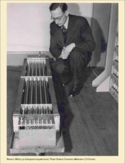

<div>
<lead>Kurssin oppimistavoitteisiin sisältyy konekielisen ohjelmoinnin perusteet. Konekielistäkään ohjelmointia ei opi ilman harjoittelua. Titokone on ttk-91 ohjelmien kehittämis- ja suoritusympäristö. TitoTrainer on Titokoneen päälle rakennettu harjoitteluympäristö, jossa annettujen ttk-91 ohjelmointitehtävien vastauksien oikeellisuus tarkistetaan automaattisesti.</lead>
</div>

## Titokone
Titokone on simulaattori, jossa voi suorittaa ttk-91 ohjelmia. Titokoneelle voi antaa suoritettavan ttk-91 ohjelman käyttäen joko symbolista (k91) tai numeerista (b91) esitysmuotoa. Yleensä ohjelmat annetaan kirjoitettuna symbolisella ttk-91 konekielellä ja ne käännetään numeeriseen muotoon ennen suoritusta. Titokoneeseen sisältyy simulaattorin lisäksi myös seuraavat komponentit.

_Symbolisen konekielen kääntäjä_ lukee ttk-91 symbolisella konekielellä kirjoitetun ohjelman (esim. hello.k91) ja kääntää sen ttk-91 konekielelle (esim. hello.b91). Symbolisia konekielisiä ohjelmia voi kirjoittaa millä tahansa tekstieditorilla, kunhan vain muistaa laittaa tiedoston nimen loppuliitteeksi ".k91".

_Simulaattori_ lukee konekielisiä ohjelmia (hello.b91) yksi konekäsky kerrallaan ja emuloi sen aiheuttamat toiminnot simuloidussa ttk-91 järjestelmässä (ks. Luku 5.1). Esimerkiksi konekäskyn "add&nbsp;r1,&nbsp;=1000" suorittamisen tuloksena simuloidun rekisterin r1 arvoa kasvatetaan luvulla 1000 ja simuloidun tilarekisterin SR bitit GEL asetetaan ilmaisemaan tuloksen suhdetta lukuun nolla. Jos yhteenlaskusta aiheutui ylivuoto, se merkitään tilarekisterin SR bittiin O.

_Ohjelmiston kehitysympäristön_ avulla voidaan säätää kommentoinnin määrää symbolisen konekielen käännösaikana ja ohjelman suoritusaikana simulaattorissa. Se näyttää suoritusaikana järjestelmän rekistereiden ja muistin sisällön. Lisäksi se sallii suorituksen vain yksi konekäsky kerrallaan, mikä helpottaa ohjelmointivirheiden löytämistä.

_Animaattori_ aukeaa (optiona) ohjelman suoritusaikana omaan ikkunaansa ja näyttää ohjelman suorituksen animoidusti suorittimen rekisterien ja muistin tasolla. Esimerkiksi konekäskyn "add&nbsp;r1,&nbsp;=1000" muistista noudon yhteydessä se näyttää, kuinka kyseinen konekäsky haetaan muistista väylän kautta suorittimen käskyrekisteriin IR. Saman käskyn suorituksen yhteydessä se näyttää visuaalisesti, kuinka a) rekisterin r1 arvo viedään ALU:un, b) vakion 1000 arvo viedään IR:stä ALU:un ja d) lopulta ALU:n tulos viedään r1:een.

_Graafinen käyttöliittymä_ kokoaa kaikki edellä mainitut komponentit yhteen, jolloin niitä on helppo käyttää. Se koostuu useasta eri ikkunasta ja kehyksestä, joiden kokoa voi dynaamisesti säätää.

### Titokoneen käyttö
Titokonetta on tarkoitus käyttää symbolisen konekielen perusteiden harjoitteluun. Ohjelmat kirjoitetaan tekstieditorilla ttk-91 symbolisella konekielellä, ladataan Titokoneelle, käännetään ja lopuksi suoritetaan simulaattorissa hyödyntäen ohjelmiston kehitysympäristöä ja animaattoria.

Titokoneen omalle koneelle asennettavat eri versiot ja käyttöohjeet löytyvät verkkosivulta https://www.cs.helsinki.fi/group/titokone/. Titokoneen verkkosivulla on useita eri [jar](https://en.wikipedia.org/wiki/JAR_(file_format))-paketteja. Suosittelen käyttämään versiota [titokone_1.203.jar](https://www.cs.helsinki.fi/group/titokone/distr/titokone-1.203.jar), koska sitä käytetään seuraavaksi esiteltävässä TitoTrainer'issa. Helpoin tapa suorittaa Titokonetta on ladata (klikkaamalla ylläolevaa linkkiä) sen jar-paketti omalle koneelle ja avata se Javan suoritusympäristössä ([JRE](https://en.wikipedia.org/wiki/JRE), Java Runtime Environment).

Java-ohjelmien suorittamista varten järjestelmässäsi täytyy olla asennettuna jokin Javan suoritusympäristö. Se voi olla Oraclen oma toteutus (esim. _Java SE_) tai avoimen lähdekoodin toteutus (esim. _OpenJDK (Java)_ tai _Amazon Corretto_). Viimeksi mainitut ympäristöt löytyvät Windows'in Software Center'istä, joka löytyy Windows-haulla näytön vasemmasta alanurkasta hakusanalla "Software Center" (Windows-10). Javan asentamista varten on ohjeita myös [täällä](https://materiaalit.github.io/tmc-asennus/netbeans_for_linux/).

Titokoneen verkkosivulta löytyy myös sen [käyttöohje](https://www.cs.helsinki.fi/group/titokone/v1.100/kayttoohje/manual_fi.html) ja [asennusohje omalle koneelle](https://www.cs.helsinki.fi/group/nodes/kurssit/tito/titokone/asennus/asennus.html). Huomioi, että ohjetta ei ole päivitetty koskien Javan asennusta. Huomaa, että Titokoneessa on se piirre, että oletusarvoisesti siinä on valittuna valmiiksi käännetyt "_b91 binary_" -tyyppiset tiedostot, joten valitse ohjelmatiedoston tyypiksi "_k91 source_".

Samalta verkkosivulta löytyy myös kokoelma ttk-91 esimerkkiohjelmia, hakemistossa [esimerkit](https://www.cs.helsinki.fi/group/nodes/kurssit/tito/esimerkit/). Voit ladata ne omalle koneellesi, ja valita ne sitten Titokoneelle syötteeksi käännöstä ja suoritusta varten.

## TitoTrainer
TitoTrainer on ttk-91 symbolisen konekielisen ohjelmoinnin harjoitteluympäristö. Se sisältää noin 50 ttk-91 ohjelmoinnin harjoitustehtävää. TitoTrainer pitää kirjaa kunkin opiskelijan edistymisestä.

Tehtävissä pyydetään toteuttamaan joko kokonainen ttk-91 ohjelma tai sen osa. Kun tehtävän vastaus on valmis, opiskelija painaa Lähetä-nappia. Järjestelmä kääntää ja suorittaa näin määritellyn ohjelman Titokoneessa (versio 1.203) ja antaa palautteessaan tiedon ohjelman oikeellisuudesta sekä rekistereiden, muistin ja symbolitaulun sisällöstä suorituksen päättymishetkellä. Virhetilanteissa se voi antaa myös vihjeitä virheen laadusta.

TitoTraineria ei ole integroitu Titokoneen ohjelmiston kehitysympäristöön, joten isompien ohjelmointiongelmien sattuessa tehtävä kannattaa ratkaista ensin Titokoneessa ja sitten kopioida toimiva vastaus TitoTraineriin. Jos TitoTrainer-tehtävässä pyydetään toteuttamaan vain ohjelman osa, niin muista kopioida myös valmiiksi annetut ohjelman osat Titokoneella testattavaan ohjelmaan. Vastaavasti, muista tässä tapauksessa kopioida vain pyydetty ohjelman osa TitoTraineriin.

TitoTraineria käytetään suoraan yliopiston palvelimella osoitteessa [TitoTrainer2](http://titotrainer2.users.cs.helsinki.fi/). Luo sinne oma tunnus ja kirjaudu sopivalle kurssille (esim. "MOOC 2019-2020"). Jos TitoTrainer ei jostain syystä tunnu toimivan (verkkosivu valittaa sisäisestä virheestä, tms), se täytyy käynnistää uudelleen.  Lähetä ongelmasta sähköpostia osoitteeseen mailto:atk-apu@cs.helsinki.fi, jolloin tilanne korjataan yleensä aika pian. Joidenkin päivitysten jälkeen TitoTrainer ei vain käynnisty uudelleen automaattisesti, vaikka näin pitäisi tapahtua.

### TitoTrainer tehtävät
Tito-Trainer tehtävissä on niiden nimen alussa luokittelutietoa (esim. a-150 Simppeli koodisegmentti), jossa ensimmäisenä oleva kirjain kertoo päätason:

```
a. aloittelija, yksinkertainen koodi, if-then-else, silmukat
b. monimutkaisempaa koodia, tietorakenteiden käyttö
c. aliohjelmien kutsuminen, konekielen hyvä ymmärrys, koodin optimointi
d. aliohjelmien toteutus, moniulotteiset taulukot
e. kokonaiset ohjelmat aliohjelmineen, laiteajuri
f. itseään muokkaavaa koodia ynnä muuta kivaa
```

Päätason perässä oleva kolminumeroinen luku kertoo päätason sisällä vaikeusasteen (100=helppo, 900=vaikea). On suositeltavaa, että tehtävät tehdään tasojärjestyksessä helpoimmasta vaikeampaan. Vaikeusasteella 700 tehtävät millä tahansa tasolla voivat olla haastavia. Vaikeusasteen 900 tehtävät menevät jo syventävien oppimistavoitteiden puolelle.

Ohjelmointi on hauskaa ja siten myös konekielinen ohjelmointi. Älä kuitenkaan käytä kaikkea aikaasi näiden 50 tehtävän tekemiseen, koska kurssilla on paljon muutakin opittavaa. Hyvä tavoite olisi tehdä vaikeusasteen 100 - 660 tehtävät tasoilla a - e.

Perustavoitteet symbolisella konekielellä ohjelmoinnille tällä kurssilla ovat seuraavat. Osaat toteuttaa symbolisella ttk-91 konekielellä erilaisten tietorakenteiden (muuttujat, 1- ja 2-ulotteiset taulukot, tietueet) muistivaraukset ja niihin viittaamiset. Osaat käyttää tietorakenteita myös osoitinmuuttujien avulla. Osaat toteuttaa koodissa haarautumiset ja erilaiset toistolauseet. Osaat käyttää (seuraavassa luvussa esiteltäviä) aliohjelmia ja funktioita sekä toteuttaa ne. Osaat selittää, mikä on aktivointitietue ja aktivointitietuepino. Osaat käyttää arvo- ja viiteparametreja. Osaat varata globaaleja tietorakenteita ja aliohjelmien paikallisia tietorakenteita. Osaat viitata aliohjelmissa parametreihin sekä globaaleihin ja paikallisiin tietorakenteisiin.


<!-- quiz 5.5.??? ????????????????? -->

<div><quiz id="8b46b1d9-58a5-46d0-8a0c-4738c389ab9c"></quiz></div>
<div><quiz id="88abf4e0-56fd-40fc-9b32-45e3d041a028"></quiz></div>
<div><quiz id="5602cf49-36be-47c7-8848-2bfbc5cd5bd3"></quiz></div>
<div><quiz id="671eb0b6-41a2-42ef-a1df-34bb83d61bea"></quiz></div>
<div><quiz id="42d3fb15-2a88-4da1-a46b-222c84dd257a"></quiz></div>
<div><quiz id="60609033-3d57-48aa-a319-3148d307003e"></quiz></div>

<text-box variant="example" name="Historiaa:  Akustinen viiveputki">

William B. Shockley ja J. Presper Eckert kehittivät 1946 muistiteknologian, joka perustui akustiseen elohopeaviiveputkeen. Kvartsikide muutti pietsosähköisen ilmiön avulla sähkövirran bitit putkessa eteneväksi akustiseksi signaaliksi. Signaali eteni putkessa vakionopeudella. Muunnos toimi myös toiseen suuntaan tiedon lukemiseksi. Kun data ehti edetä putken toiseen päähän, sen arvo voitiin lukea ja samalla se kirjoitettiin takaisin putken alkupäähän. Yhden 1,45m pitkän putken kapasiteetti oli 1000 bittiä. Maurice Wilkes käytti elohopeaviiveputkia vuonna 1949 EDSAC-koneen keskusmuistina.

<!-- kuva: ch-5-5-viiveputki    -->


<div>
<illustrations motive="ch-5-5-viiveputki"></illustrations>
</div>

</text-box>


## Yhteenveto
Tämä luku käsitteli konekielistä ohjelmointia esimerkkikonetta ttk-91 käyttäen. Kertasimme ensin ttk-91 suorittimen rakenteen ja esittelimme, kuinka valinta- ja toistolauseet toteutetaan konekielellä. Sen jälkeen kävimme läpi rakenteisen tiedon toteutustapoja ja rakenteiseen tietoon viittaamista yleensä indeksoidun tiedonosoitusmoodin avulla. Tutustuimme koodin optimoinnin käsitteeseen ja muutamaan yksinkertaiseen tapaan toteuttaa optimoitua koodia. Lopuksi esittelimme konekielisen ohjelmoinnin harjoitteluympäristöt Titokone ja TitoTrainer.

Vastaa alla olevaan kyselyyn kun olet valmis luvun 5 tehtävien kanssa.

<div><quiz id="a36df58a-8224-4ccd-bf56-d809c12d2e12"></quiz></div>
