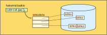

<lead>Tässä aliluvussa käydään läpi massamuistien eri toteutustavat. Erityisesti keskitytään kovalevyjen toteutukseen ja saantiajan laskentaan.</lead>

## Tiedostojärjestelmä ja tiedostot
Tieto massamuistissa on yleensä organisoitu erillisiksi tiedostoiksi. Esimerkiksi tiedosto program.exe sisältää windows-käyttöjärjestelmän tunnistaman ladattavan ohjelman ja cute-cat.jpg sisältää käyttäjän tallettaman soman kissakuvan. Käyttöjärjestelmä pitää kirjaa kaikista tiedostoista ja niiden sijainneista massamuistissa. Se valvoo tiedon pääsyoikeuksia, jotta Pekka ei vahingossa pääse katsomaan Maijan kissakuvia, tai että kukaan tavallinen käyttäjä ei pääse muuttamaan ohjelmakoodeja ilman lupaa.

Tiedostolla voi olla oma sisäinen rakenteensa, jolloin se koostuu useasta erillisestä [tietueesta](https://fi.wikipedia.org/wiki/Tietue). Esimerkiksi lennonvarausjärjestelmässä yksi tietue voi sisältää yhden asiakkaan tietyn varatun lennon tiedot. Emme käsittele tällaisia tiedostojärjestelmiä tässä tämän enempää.

Yleensä tiedosto koostuu useasta tavusta, jotka esittävät merkkipohjaista tietoa tai jotain rakenteista tietoa kuten kuvaa tai ääninäytettä.  Tiedostoa voidaan käsitellä kokonaisuutena (esim. kuva) tai tavu kerrallaan (esim. tekstinkäsittelyssä tekstitiedosto). 

Käyttöjärjestelmä muuntaa tekstimuotoiset tiedostonimet hakemistopolkuineen (esim. "/usr/home/kerola/pictures/cats/cute-cat.jpg") tiedostojärjestelmän sisäisiksi osoitteiksi, mikä tekee tiedostojen käyttämisestä helppoa ja kätevää. Tiedostojärjestelmä sitten tarkentaa sisäisen osoitteen suoritusaikana tiettyyn kovalevyyn ja täsmälliseen sijaintiin siellä. On hyvin kätevää, kun ohjelmaa kirjoittaessa ei tarvitse ottaa kantaa siihen, minkä tyyppisellä laitteella tai missä jokin tiedosto sijaitsee. 

Aina kun tiedostoa avataan käyttöä varten, järjestelmä tarkistaa, mitä oikeuksia tiedoston omistaja on antanut tiedoston avaamista haluavalle ohjelmalle. Ohjelman oikeudet taas määräytyvät sen mukaan, kuka käyttäjä on ohjelman käynnistänyt. Jos Maija ei ole antanut lukuoikeutta muille tiedostoonsa cute-cat.jpg, niin tavallisen käyttäjän Pekan (tai haittaohjelman TroubleMkr) käynnistämä ohjelma ei pysty avaamaan tiedostoa cute-cat.jpg ja Pekkaa harmittaa. Toisaalta, jos Pekka (tai haittaohjelma TroubleMkr) toimii järjestelmän ylläpitäjän oikeuksilla, niin hän (se) voi joka tapauksessa lukea tiedostoa cute-cat.jpg, mikä taas voi harmittaa Maijaa!

Jos tiedostoa luetaan vähän kerrallaan, niin tiedostojärjestelmä pitää kirjaa siitä, missä kohtaa kukin prosessi on kutakin tiedostoa lukemassa. Vaikka prosessi lukisi tiedostoa yksi merkki kerrallaan, niin tiedostojärjestelmä lukee niitä massamuistista isompi lohko kerrallaan muistiin ja lohkon koko sopii hyvin yhteen massamuistilaitteen teknologian kanssa. Esimerkiksi levymuistista voisi lukea 4 KB lohkoja käyttöjärjestelmän ylläpitämään puskuriin, josta käyttäjäprosessi saa tietoja käyttöönsä tavu kerrallaan halutessaan. 

<!-- Kuva: ch-8-2-tiedoston-lohkot -->

<illustrations motive="ch-8-2-tiedoston-lohkot" frombottom="0" totalheight="40%"></illustrations>

Tiedoston lohkot on talletettu kovalevylle siellä oleviin vapaisiin paikkoihin ja tiedostojärjestelmä pitää kirjaa lohkojen sijainnista kovalevyllä. Tiedoston nimen perusteella hakemistosta löytyy tiedoston _hakemistoalkio_, josta löytyy esim. linkki sen tiedoston lohkolistaan. Lohkolistassa on tiedot jokaisen tämän tiedoston levylohkon sijainnista.

Tiedostojärjestelmän tarkempi toiminta esitellään yliopiston käyttöjärjestelmäkurssilla.

## Kovalevyn (kiintolevyn) toteutus
Tyypillisin massamuistilaite nykyisissä tietokoneissa on edelleen [kovalevy](https://www.wikiwand.com/fi/Kiintolevy), vaikkakin varsinkin kannettavissa laitteissa SSD-levyt ovat yleistymässä. Käsittelemme SSD-levyjä lisää vähän myöhemmin.

Kovalevyä käytetään järjestelmässä kahteen tarkoitukseen, virtuaalimuistin tukimuistina ja tiedostojen talletukseen. Kummassakin tapauksessa tieto talletetaan levylle samalla tavalla, sektori kerrallaan. Sektori on pienin datamäärä, jota levylle voi yhdellä kertaa kirjoittaa tai jota sieltä voi lukea. Sektorin koko on tyypillisesti 0.5-4 KB. 

Tiedostojärjestelmä siirtää tietoja keskusmuistin ja levyn välillä tehokkuussyistä isohkoina _levylohkoina_. Levylohkon koko on kussakin tiedostojärjestelmässä vakio ja käytännössä sektorin koon pieni monikerta, esimerkiksi 2 tai 4 sektoria. Kunkin levylohkon sektorit ovat sellaisia, että ne on nopea lukea yhteen menoon levyltä. Jos tiedoston koko on pienempi kuin levylohkon koko, sille varataan silti aina kokonainen levylohko tilaa. Suuret tiedostot varaavat hukkatilaa levyltä keskimäärin puolikkaan levylohkon verran, koska viimeinen levylohko jää vajaaksi. 

Virtuaalimuisti siirtää tietoja keskusmuistin ja levyn välillä _sivuina_, mikä on vain eri nimi muistilohkoille. Usein sivun koko ja levylohkon koko ovat samoja.

<!-- kuva: ch-8-2-levyn-kaytto    -->

<illustrations motive="ch-8-2-levyn-kaytto" frombottom="0" totalheight="100%"></illustrations>

Virtuaalimuisti ja tiedostojärjestelmä siis käyttävät kovalevyä hyvin samalla tavalla. Tämän vuoksi käyttöjärjestelmissä on esimerkiksi toteutettu ensin tiedostojärjestelmä ja sitten sen päälle virtuaalimuisti, jotta samoja asioita ei tarvitse toteuttaa moneen kertaan. Tai sitten ensin on toteutettu virtuaalimuisti ja tiedostojärjestelmä sen päälle.

Kovalevyn kapasiteetista on huomattavan iso osuus varattu virtuaalimuistin tukimuistiksi. Siellä täytyy olla tilaa jokaiselle järjestelmässä olevan prosessin kaikille tiedoille. Et siis voi käyttää järjestelmäsi ainoata kovalevyä pelkästään tiedostojen tallentamiseen! Käyttöjärjestelmä päättää järjestelmän alustuksen yhteydessä, kuinka suuri osuus kovalevystä varataan virtuaalimuistin toteutukseen. Jos järjestelmään sisältyy muita kuin käyttöjärjestelmän sisältäviä kovalevyjä, niin ne voi kokonaisuudessaan hyödyntää tiedostojen tallentamiseen.

### Kovalevyn rakenne 
Levy (levykkö) koostuu yhdestä tai useammasta päällekkäisestä levystä, joissa kussakin tietoa on yleensä talletettu molemmille levypinnoille. Suuremmissa (esim. 8 levyn) levyköissä voi olla, että ylin tai alin levypinta ei ole käytössä. Tiedon talletus levypinnoille tapahtuu samankeskisten urien (esim. 500-1000 kpl) avulla, jolloin uralta voi (esim.) lukea dataa luku- ja kirjoituspäätä liikuttamatta. Päällekkäin olevat urat eri levypinnoilla muodostavat sylinterin ja koko sylinteriltä voi lukea tai kirjoittaa dataa liikuttamatta luku- ja kirjoituspäätä.

Levykkö pyörii koko ajan, esimerkiksi nopeudella 3600 rpm (rounds per minute, kierrosta minuutissa), 7200 rpm tai jopa 10000 rpm. Levyt ovat hermeettisesti suljettuja, jotta niiden sisään ei pääse pölyä tai muuta roskaa. Levypinnat liikkuvat luku- ja kirjoituspään alla hyvin nopeasti (esim. 1000-2000 m/s), joten luku- ja kirjoituspäähän kohdistuvat aerodynaamiset voimat ovat valtavat. Näitä voidaan vähentää täyttämällä levyköt ilmaa kevyemmällä kaasulla, yleensä heliumilla. Luku-ja kirjoituspäiden aerodynamiikkaa kehitetään tuulitunnelien avulla.

Jokaisella levypinnalla on oma luku- ja kirjoituspäänsä, joiden hakuvarret ovat kaikki kiinni samassa akselissa. Hakuvarret kääntyvät kaikki yhtäaikaa ja niillä valitaan käytössä oleva ura. Jos seuraavaksi viitattava data ei ole samalla uralla kuin edellinen, niin hakuvartta pitää kääntää oikealle uralle. Tästä aiheutuu usein selvästi kuuluva surraava ääni tietokoneessa. Hakuvarren siirtoaika on merkittävä hidaste datan viittaamiseen levyllä.

Jokainen ura on jaettu sektoreihin (esim. 100 kpl) ja sektori on pienin mahdollinen yhdellä kertaa levyltä luettavissa/kirjoitettavissa oleva data. Usein kuitenkin levyltä luetaan/kirjoitetaan vielä suurempia levylohkoja kerrallaan, jolloin levylohkon koko on sektorien koon pieni monikerta. Tällä tavoin levyn tiedonsiirtonopeus saadaan suuremmaksi. 

<!-- kuva: ch-8-2-levyn-rakenne    -->

<illustrations motive="ch-8-2-levyn-rakenne" frombottom="0" totalheight="100%"></illustrations>

Pienissä ja halvoissa levyasemissa joka uralla on sama määrä sektoreita. Suurissa levyissä uloimmilla urilla voi enemmän sektoreita, mikä tekee levyn käytöstä vaikeampaa mutta kasvattaa sen kapasiteettia huomattavasti. Yleensä levyissä (pieni) osa sektoreista on merkitty varasektoreiksi, jotka otetaan käyttöön alkuperäisten sektoreiden vikaannuttua. Näin koko levyn muodollinen kapasiteetti säilyy samana, vaikka muutamia sektoreita vikaantuisikin.

Sektoreiden ja urien välissä on levypinnoilla välejä ja ehkä myös erikoismerkkejä, joiden avulla luku-ja kirjoituspään ja levyn asento voidaan tunnistaa.

### Kovalevyn saantiaika
Ajatellaan yksinkertaista levyä, jossa joka uralla on sama määrä sektoreita. Kuinka kauan kestää tietyn sektorin lukeminen? Sektorin _saantiaika_ koostuu kolmesta komponentista. Ensinnäkin on _hakuaika_, mikä tarkoittaa luku- ja kirjoituspään siirtämistä oikealle uralle. Yksinkertaistetussa muodossa tätä voi estimoida lineaarisesti siirrettävien urien lukumäärän suhteen. Todellisuudessa hakuvarsi kiihdyttää ensin huippunopeuteensa, jatkaa siirtymistä huippunopeudella ja lopulta hidastaa pysähtyen juuri oikealle uralle.

Toinen komponentti on _pyörähdysviive_ eli se aika mikä kuluu, kunnes oikea sektori on luku- ja kirjoituspään kohdalla. Jos sektori on satunnainen, niin tämä on keskimäärin puolen kierroksen kääntymiseen kuluva aika. Esimerkiksi, jos pyörimisnopeus on 3600 rpm, niin yhteen kierrokseen kuluu 1/3600&nbsp;min&nbsp;=&nbsp;16.6&nbsp;ms, mikä on tosi pitkä aika! Tätä voidaan huomattavasti keskimäärin pienentää lukemalla (kirjoittamalla) yhteen menoon usea sektori samalla sylinterillä.

Kolmas saantiajan komponentti on itse datan siirto, mikä tarkoittaa yksinkertaisesti yhden sektorin lukemista tai kirjoittamista. Jos sektoreita on uralla 100 kpl, niin sektorin lukemiseen (kirjoittamiseen) menee 1/100 levyn pyörähdysajasta. Esimerkiksi, jos pyörimisnopeus on 3600 rpm ja sektoreita uralla 100 kpl, niin yhden sektorin lukemiseen kuluu 1/100\*16.6&nbsp;ms&nbsp;=&nbsp;0.16&nbsp;ms.

Käytössä on erilaisia tapoja optimoida keskimääräistä saantiaikaa jo mainitun usean sektorin levylohkon lisäksi. Konstit perustuvat yleensä siihen, että oletetaan jonossa olevan koko ajan usea levypyyntö. Sen jälkeen koetetaan palvella nuo levypyynnöt sellaisessa järjestyksessä, että kokonaishakuaikojen summa olisi mahdollismman pieni. Kotikoneessa tämä ei usein ole merkittävä ongelma, koska suorituksessa on yhdellä kertaa yleensä vain yksi sovellus. Levyjen käytön optimointimenetelmiin perehdytään tarkemmin yliopiston käyttöjärjestelmäkurssilla.

## SSD ja NVMe
Kovalevyjen rinnalle massamuisteiksi on viime vuosina tullut flash-teknologiaan perustuvia muisteja. [SSD-levyissä](https://fi.wikipedia.org/wiki/SSD) ei ole lainkaan liikkuvia osia, minkä vuoksi ne ovat erityisen käyttökelpoisia kannettavissa laitteissa. Ne ovat toistaiseksi kalliimpia ja kuin kovalevyt (per GB). Ne ovat myös selvästi kovalevyä nopeampia, koska tietoon viittamiseen ei tarvita hakuaikoja tai pyörähdysviipeitä. Tiedot voi lukea pieniä paloina, mutta kirjoitus täytyy tehdä aina suhteellisen suurina lohkoina. Lisäksi niissä ei ole lämpöä tuottavia sähkömoottoreita ja ne ovat hiljaisia. Pienenä ongelmana (hinnan lisäksi) tällä hetkellä on, että muistilohkoja voi kirjoittaa uudelleen vain rajallisen määrän kertoja (esim. 2000-100000 kertaa).  

Alkuaan SSD-levyjä tuotiin markkinoille nimenomaan korvaamaan kovalevyjä ja ne myös liitettiin järjestelmään samojen väylien kautta. Niiden käyttöönotto oli helppoa, kun niitä pystyttiin käyttämään samojen rajapintojen läpi kovalevyjen kanssa. Tälla tavoin SSD-levyistä ei saatu kaikkea tehoa irti, koska kovalevyjen rajapinnat (ja väylät) rajoittivat niiden nopeutta. Nykyään SSD-levyjäkin liitetään järjestelmään myös nopeampien väylien kautta.

SSD-levyjen rinnalle on tullut [NVMe-levyjä](https://en.wikipedia.org/wiki/NVM_Express), jotka eivät yritäkään näyttää kovalevyiltä. Tuollaista massamuistia käytetään erityisesti flash-teknologialle optimoiduilla tavoilla, jolloin ne ovat nopeampia kuin SSD-toteutukset. Ne liitetään aina nopeaan väylään. 

On luultavaa, että tämä flash-muistiteknologian kehittäminen massamuistien toteutuksessa jatkuu ja johtaa (vuosien päästä) lopulta kovalevyjen käytön loppumiseen. Uusi teknologia tulee luultavasti aiheuttamaan merkittäviä muutoksia käyttöjärjestelmien ja sovellusten toteutuksiin jo sitä ennen, kun muistihierarkiaan tulee uusi selkeä taso keskusmuistin ja kovalevyn väliin.

## Levypalvelimet
Levypalvelimet antavat samanlaista palvelua kuin muutkin massamuistit, mutta ne sijaitsevat eri tilassa (eri rakennuksessa? eri kaupungissa?) kuin niitä käyttävät järjestelmät. Levypalvelimet ovat yleensä suuria ja niissä on yleensä varauduttu yhden tai kahden levykön rikkoutumiseen jollain tavalla (esim. [RAID-teknologialla](https://simple.wikipedia.org/wiki/RAID)). Tiedot ovat siis siellä paremmassa turvassa kuin omalla kovalevyllä. 

Levypalvelimia käytetään verkon ylitse, minkä vuoksi niiden saantiajat ovat sekuntiluokkaa. Tätä kuitenkin nopeutetaan tehokkaalla puskuroinnilla, jossa tarvittavat tiedot kopioidaan taustalla omalle koneelle ja tarvittaessa sitten takaisin palvelimelle.

## Pilvitallennus
Pilvitallennus on suhteellisen uusi tapa tallettaa tietoja. Pilvitallennukseen liittyy usea suuri palvelinkeskus, joissa kussakin on suuri määrä levypalvelimia. Tietoja kopioidaan eri palvelinkeskusten välillä, jolloin ne ovat varmemmin tallessa. Samoihin tietoihin voi päästä käsiksi ympäri maailmaa ja kukin käyttäjä luultavasti käyttää lopulta häntä lähinnä olevaa palvelinkeskusta. Käytettäessä pilvitallennusta pilvipalvelun tiedostot näkyvät paikallisena levypalvelimena. Pilvitallennus on hyvä vaihtoehto esimerkiksi valokuvien tai videoiden varmuuskopiointiin.

Pilvitallennus on osa laajempaa pilvipalvelua, jossa asiakkaat voivat ostaa/vuokrata erilaisia palveluja verkossa olevasta "pilvestä" haluamansa määrän. Pilvilaskennassa ostetaan/vuokrataan laskentakapasiteettia (suoritinaikaa) ja pilvijärjestelmässä ostetaan/vuokrataan kokonainen järjestelmä ohjelmistoineen. Pilvijärjestelmä voi sisältää suuren määrän suorittimia tai esimerkiksi tehokkaan tietokantaohjelmiston, joita asiakas ei halua itse ostaa tai hallinnoida.

### Quiz 8.2.1 Sektorin ja levylohkon saantiajat

<quiz id="ad4ba2d8-8a00-4123-90f8-e51474de1b76"></quiz>

<quiz id="b3fb891d-8f53-44ea-85df-edeb6c3e7f87"></quiz>

<quiz id="afc11b28-8bf5-4563-a6c9-e8548e2669e7"></quiz>

